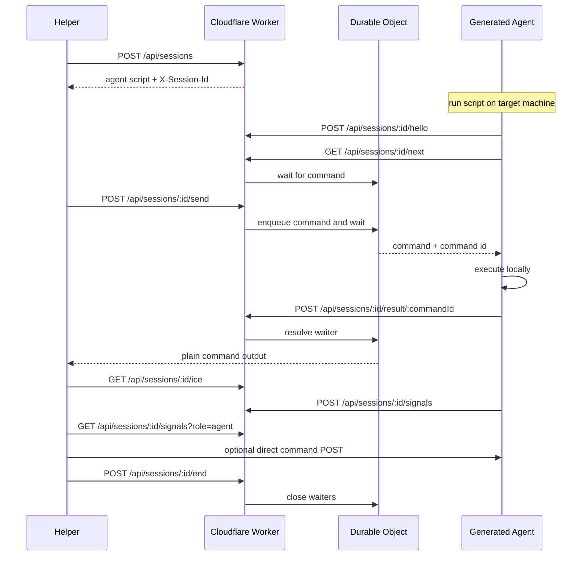

# Shell Over Edge

[](https://github.com/Stoffberg/shell-over-edge/actions/workflows/ci.yml)
[](https://github.com/Stoffberg/shell-over-edge/actions/workflows/deploy.yml)
[](LICENSE)

Reach any shell from anywhere.

Start a tiny generated agent on one machine, then send commands to it from any other machine over plain HTTPS. No dashboard. No account flow. A session UUID is the capability.

Production: [https://soe.stoff.dev](https://soe.stoff.dev)

## The Shape



R2 stores session metadata. The Durable Object coordinates the live command handoff and direct signaling state.

## Quick Start

Start a POSIX agent on the target machine:

```sh
curl -sS -X POST https://soe.stoff.dev/api/sessions | sh
```

Start a PowerShell agent on the target machine:

```powershell
irm -Method Post https://soe.stoff.dev/api/sessions.ps1 | iex
```

The agent prints the UUID and copies it to the clipboard when possible. The create response also returns it in `X-Session-Id`.

Send a command:

```sh
curl -sS -X POST https://soe.stoff.dev/api/sessions/<uuid>/send --data 'pwd'
```

End the session:

```sh
curl -sS -X POST https://soe.stoff.dev/api/sessions/<uuid>/end
```

## Core API

| Endpoint | Body | Response |
| --- | --- | --- |
| `POST /api/sessions` | empty | POSIX shell agent script |
| `POST /api/sessions.ps1` | empty | PowerShell agent script |
| `POST /api/sessions/<uuid>/send` | raw text or JSON | plain command output |
| `POST /api/sessions/<uuid>/end` | empty | `ended` |

For simple commands, send raw text:

```sh
curl -sS -X POST https://soe.stoff.dev/api/sessions/<uuid>/send --data 'uname -a'
```

Use JSON only when you need options:

```json
{
  "body": "pwd",
  "cwd": "/tmp",
  "timeoutSeconds": 30
}
```

`timeout` is also accepted. Timeouts are clamped from 1 to 3600 seconds.

## Direct Transport

The relay path is the default because it works anywhere outbound HTTPS works.

Clients that can run a richer helper may use the Worker as a rendezvous plane:

| Endpoint | Body | Response |
| --- | --- | --- |
| `GET /api/sessions/<uuid>/ice` | empty | ICE server JSON |
| `POST /api/sessions/<uuid>/signals` | signal JSON | signal JSON |
| `GET /api/sessions/<uuid>/signals?role=agent` | empty | signal list JSON |

The direct upgrade is deliberately small:

1. fetch ICE config when using WebRTC
2. exchange short-lived direct signals
3. try the direct stream with a small timeout budget
4. if direct fails, fall back to `/send`

The generated curl-first agents do not open inbound listeners by default. Real internet NAT traversal needs a client transport that can discover paths and hole punch; this API keeps that path separate from the reliable relay fallback.

Without TURN secrets, `/ice` returns Cloudflare STUN only. With Cloudflare TURN configured, it returns short-lived TURN credentials generated server-side.

## Security Model

Sessions are UUID capabilities. Anyone with the UUID can use that session until it ends or expires.

There are no bearer tokens, helper tokens, agent tokens, URL tokens, or auth headers in the current API.

Treat a session UUID like a temporary password:

- keep it out of logs and screenshots
- end the session when finished
- do not leave agents running unattended

## Limits

| Limit | Value |
| --- | --- |
| Session TTL | 2 hours |
| Cleanup retention | 24 hours after expiry |
| Command body | 64 KB |
| Result body | 1 MB |
| Direct signal body | 32 KB |
| Direct signal TTL | 60 seconds, max 120 seconds |
| Timeout | 1 to 3600 seconds |

## Agent Resources

- Compact agent reference: [`llms.txt`](llms.txt)
- Reusable agent skill: [`skills/shell-over-edge/SKILL.md`](skills/shell-over-edge/SKILL.md)
- Raw `llms.txt`: [raw.githubusercontent.com/Stoffberg/shell-over-edge/main/llms.txt](https://raw.githubusercontent.com/Stoffberg/shell-over-edge/main/llms.txt)
- Raw skill: [raw.githubusercontent.com/Stoffberg/shell-over-edge/main/skills/shell-over-edge/SKILL.md](https://raw.githubusercontent.com/Stoffberg/shell-over-edge/main/skills/shell-over-edge/SKILL.md)

## Tech

- Cloudflare Workers for the public HTTP API
- Hono for routing
- Durable Objects for live command coordination
- R2 for session metadata and cleanup
- TypeScript for the Worker and generated agent builders
- Vitest for unit, integration, generated-agent, and direct-upgrade e2e tests

## Repo Layout

```text
src/
  worker.ts                         Cloudflare Worker module entry
  worker/
    app.ts                          Hono app, root route, error/cache middleware
    env.ts                          Cloudflare binding types
    routes/sessions.ts              Public session API and agent callbacks
    durable-objects/command-bridge.ts
    services/session-bridge.ts      Durable Object lookup boundary
    services/session-store.ts       R2 session metadata and cleanup
  agent/
    shell.ts                        Generated POSIX agent
    powershell.ts                   Generated PowerShell agent
    terminal-usage.ts               Root terminal usage text
  domain/session.ts                 Session domain types
  domain/direct.ts                  Direct transport signal types
  client/direct-send.ts             Direct upgrade helper with relay fallback
  shared/                           Small generic utilities
tests/
  unit/                             Pure utilities and generated script checks
  integration/                      Worker request/response flows with fake bindings
  e2e/                              Generated agent and direct-upgrade flows
  helpers/                          Typed test harnesses
scripts/
  repo-audit.mjs                    Repo hygiene checks
  smoke-prod.mjs                    Live production smoke test
```

## Development

```sh
pnpm install
pnpm run dev
```

Full local validation:

```sh
pnpm run validate
```

That runs source typechecking, test typechecking, Vitest, repo audit, and a Wrangler dry run.

Relay/direct load e2e:

```sh
pnpm run test:load
```

## Cloudflare

Required bindings:

- R2 bucket: `SOE_MAILBOX`
- Durable Object namespace: `COMMAND_BRIDGES`
- Custom domain: `soe.stoff.dev`
- Worker name: `soe`

Required GitHub deployment secrets:

- `CLOUDFLARE_API_TOKEN`
- `CLOUDFLARE_ACCOUNT_ID`

Optional Cloudflare TURN secrets:

- `TURN_KEY_ID`
- `TURN_KEY_API_TOKEN`
- `TURN_CREDENTIAL_TTL_SECONDS`
