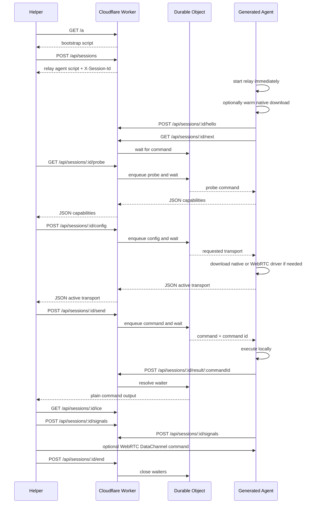

# Shell Over Edge

[](https://github.com/Stoffberg/shell-over-edge/actions/workflows/ci.yml)
[](https://github.com/Stoffberg/shell-over-edge/actions/workflows/deploy.yml)
[](LICENSE)

Reach any shell from anywhere.

Start a tiny agent on one machine, then send commands to it from any other machine over plain HTTPS. No dashboard. No account flow. An 8-character session code is the capability.

Production: [https://soe.stoff.dev](https://soe.stoff.dev)

## The Shape



R2 stores session metadata. The Durable Object coordinates the live command handoff and direct signaling state.

## Quick Start

Start a POSIX agent on the target machine:

```sh
curl -sS https://soe.stoff.dev/a | sh
```

Start a PowerShell agent on the target machine:

```powershell
irm https://soe.stoff.dev/a.ps1 | iex
```

The agent prints the session code and copies it to the clipboard when possible. The create response also returns it in `X-Session-Id`.

The bootstrap starts the HTTPS relay first. It only downloads a native binary when `SOE_WARM_NATIVE=1`, `SOE_AUTO_UPGRADE=1`, `SOE_NATIVE_URL` is set, or `/config native` asks for it. `/config webrtc` downloads the `soe-webrtc` sidecar and keeps the relay agent alive as fallback.

Send a command:

```sh
curl -sS -X POST https://soe.stoff.dev/api/sessions/<code>/send --data 'pwd'
```

Probe the machine and active agent:

```sh
curl -sS https://soe.stoff.dev/api/sessions/<code>/probe
```

Ask the agent to upgrade:

```sh
curl -sS -X POST https://soe.stoff.dev/api/sessions/<code>/config --data 'native'
curl -sS -X POST https://soe.stoff.dev/api/sessions/<code>/config --data 'webrtc'
```

Send through the WebRTC sidecar when you have the helper binary:

```sh
soe-webrtc send --base-url https://soe.stoff.dev --session <code> --body 'pwd'
```

End the session:

```sh
curl -sS -X POST https://soe.stoff.dev/api/sessions/<code>/end
```

## Core API

| Endpoint | Body | Response |
| --- | --- | --- |
| `GET /a` | empty | POSIX bootstrap script |
| `GET /a.ps1` | empty | PowerShell bootstrap script |
| `POST /api/sessions` | empty | POSIX shell agent script |
| `POST /api/sessions.ps1` | empty | PowerShell agent script |
| `GET /api/sessions/<code>/probe` | empty | JSON machine, agent, network, and transport capabilities |
| `POST /api/sessions/<code>/config` | `auto`, `relay`, `native`, `direct`, `webrtc`, or JSON | JSON active transport result |
| `POST /api/sessions/<code>/send` | raw text or JSON | plain command output |
| `POST /api/sessions/<code>/end` | empty | `ended` |

For simple commands, send raw text:

```sh
curl -sS -X POST https://soe.stoff.dev/api/sessions/<code>/send --data 'uname -a'
```

Use JSON only when you need options:

```json
{
  "body": "pwd",
  "cwd": "/tmp",
  "timeoutSeconds": 30
}
```

`timeout` is also accepted. Timeouts are clamped from 1 to 3600 seconds.

## Probe And Config

`/probe` is the first thing a helper should call after it has a session code. The response is generated by the running agent and includes:

- hardware and OS basics
- agent kind and protocol version
- shell/runtime commands available on the machine
- coarse private network addresses and latency back to `BASE_URL`
- supported transport flags for `relay`, `native`, `directHttp`, `webrtc`, and `webrtcSignaling`
- the currently active transport

`/config` is the single upgrade door. Send plain text for the transport you want:

```sh
curl -sS -X POST https://soe.stoff.dev/api/sessions/<code>/config --data 'native'
```

JSON is accepted when a client already works with structured payloads:

```json
{"transport":"webrtc"}
```

Generated shell agents pick the right driver for the OS and architecture. `native` downloads `soe-agent-*` and hands the same session to the native relay driver. `webrtc` downloads `soe-webrtc-*`, starts it beside the relay agent, and reports `active: "webrtc"` once the sidecar starts. If the requested transport cannot be activated, the response still names the active fallback so the helper can keep using `/send`.

## Direct Transport Internals

The relay path is the default because it works anywhere outbound HTTPS works.

Clients that can run a richer helper may use the Worker as a rendezvous plane:

| Endpoint | Body | Response |
| --- | --- | --- |
| `GET /api/sessions/<code>/ice` | empty | ICE server JSON |
| `POST /api/sessions/<code>/signals` | signal JSON | signal JSON |
| `GET /api/sessions/<code>/signals?role=agent` | empty | signal list JSON |

The WebRTC sidecar is deliberately separate from the tiny bootstrap:

1. fetch ICE config when using WebRTC
2. exchange short-lived direct signals
3. open an RTCDataChannel between `soe-webrtc send` and the target sidecar
4. if direct fails, fall back to `/send`

The generated curl-first agents do not open inbound listeners by default. WebRTC NAT traversal is handled by the on-demand `soe-webrtc` sidecar using `/ice` and `/signals` as the rendezvous plane.

Without TURN secrets, `/ice` returns Cloudflare STUN only. With Cloudflare TURN configured, it returns short-lived TURN credentials generated server-side.

## Security Model

Sessions are short code capabilities. Anyone with the code can use that session until it ends or expires.

There are no bearer tokens, helper tokens, agent tokens, URL tokens, or auth headers in the current API.

Treat a session code like a temporary password:

- keep it out of logs and screenshots
- end the session when finished
- do not leave agents running unattended

## Limits

| Limit | Value |
| --- | --- |
| Session TTL | 2 hours |
| Cleanup retention | 24 hours after expiry |
| Command body | 64 KB |
| Result body | 1 MB |
| Direct signal body | 32 KB |
| Direct signal TTL | 60 seconds, max 120 seconds |
| Timeout | 1 to 3600 seconds |

## Agent Resources

- Compact agent reference: [`llms.txt`](llms.txt)
- Reusable agent skill: [`skills/shell-over-edge/SKILL.md`](skills/shell-over-edge/SKILL.md)
- Raw `llms.txt`: [raw.githubusercontent.com/Stoffberg/shell-over-edge/main/llms.txt](https://raw.githubusercontent.com/Stoffberg/shell-over-edge/main/llms.txt)
- Raw skill: [raw.githubusercontent.com/Stoffberg/shell-over-edge/main/skills/shell-over-edge/SKILL.md](https://raw.githubusercontent.com/Stoffberg/shell-over-edge/main/skills/shell-over-edge/SKILL.md)

## Tech

- Cloudflare Workers for the public HTTP API
- Hono for routing
- Durable Objects for live command coordination
- R2 for session metadata and cleanup
- TypeScript for the Worker and generated agent builders
- Zig for the optional native agent
- Go and Pion for the optional WebRTC DataChannel sidecar
- Vitest for unit, integration, generated-agent, native-agent, container, and direct-upgrade e2e tests

## Repo Layout

```text
src/
  worker.ts                         Cloudflare Worker module entry
  worker/
    app.ts                          Hono app, root route, error/cache middleware
    env.ts                          Cloudflare binding types
    routes/sessions.ts              Public session API and agent callbacks
    durable-objects/command-bridge.ts
    services/session-bridge.ts      Durable Object lookup boundary
    services/session-store.ts       R2 session metadata and cleanup
  agent/
    bootstrap.ts                    Tiny bootstrap scripts with native download warmup
    shell.ts                        Generated POSIX agent
    powershell.ts                   Generated PowerShell agent
    terminal-usage.ts               Root terminal usage text
native/
  agent/main.zig                    Optional native relay agent
  webrtc/                           Optional WebRTC DataChannel sidecar
domain/
  session.ts                        Session domain types
  direct.ts                         Direct transport signal types
client/
  direct-send.ts                    Direct upgrade helper with relay fallback
shared/                             Small generic utilities
tests/
  unit/                             Pure utilities and generated script checks
  integration/                      Worker request/response flows with fake bindings
  e2e/                              Generated agent, native agent, container, and direct-upgrade flows
  helpers/                          Typed test harnesses
scripts/
  build-native-linux.mjs            Cross-build native Linux binary for container tests
  repo-audit.mjs                    Repo hygiene checks
  smoke-prod.mjs                    Live production smoke test
```

## Development

```sh
pnpm install
pnpm run dev
```

Full local validation:

```sh
pnpm run validate
```

That runs source typechecking, test typechecking, Vitest, repo audit, and a Wrangler dry run.

Relay/direct load e2e:

```sh
pnpm run test:load
```

Native agent e2e:

```sh
pnpm run test:native
```

WebRTC sidecar e2e:

```sh
pnpm run test:webrtc
```

Linux container agent e2e, requiring Docker:

```sh
pnpm run test:containers
```

Production benchmark:

```sh
pnpm run benchmark -- --runs=7 --burst=32
```

Reference run from this machine to `https://soe.stoff.dev` on June 10, 2026:

| Metric | p50 | p95 |
| --- | ---: | ---: |
| `GET /` | 18.9 ms | 76.2 ms |
| `GET /a` | 14.5 ms | 21.2 ms |
| `POST /api/sessions` | 1031.5 ms | 1120.2 ms |
| relay command round trip | 974.8 ms | 1102.2 ms |

The same run processed 32 queued relay commands in 7888.8 ms from a single agent loop. Current response sizes are 362 bytes for `/`, 2707 bytes for `/a`, 2873 bytes for `/a.ps1`, and 3441 bytes for a generated POSIX relay agent.

## Cloudflare

Required bindings:

- R2 bucket: `SOE_MAILBOX`
- Durable Object namespace: `COMMAND_BRIDGES`
- Custom domain: `soe.stoff.dev`
- Worker name: `soe`

Required GitHub deployment secrets:

- `CLOUDFLARE_API_TOKEN`
- `CLOUDFLARE_ACCOUNT_ID`

Optional Cloudflare TURN secrets:

- `TURN_KEY_ID`
- `TURN_KEY_API_TOKEN`
- `TURN_CREDENTIAL_TTL_SECONDS`

GitHub releases attach native agent binaries named for the bootstrap download path, for example `soe-agent-aarch64-linux-musl` and `soe-agent-x86_64-windows.exe`. WebRTC sidecar assets are published beside them as `soe-webrtc-aarch64-macos`, `soe-webrtc-x86_64-linux`, and `soe-webrtc-x86_64-windows.exe`.
