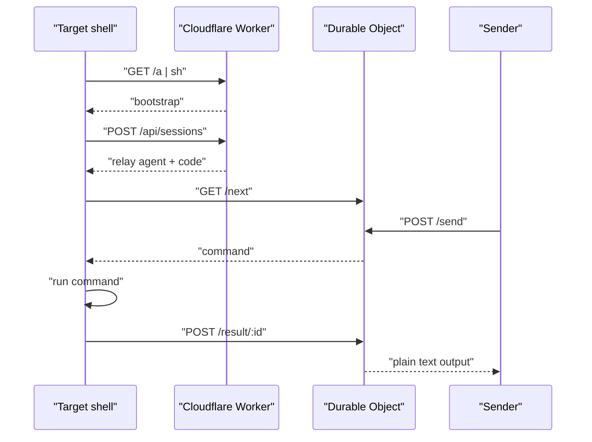

# Shell Over Edge

Reach any shell from anywhere.

[](https://github.com/Stoffberg/shell-over-edge/actions/workflows/ci.yml)
[](LICENSE)

Shell Over Edge is a tiny HTTPS relay for temporary shell access. The target machine runs a generated script, prints an 8-character code, and long-polls the Cloudflare Worker for commands. The sender posts commands to that code and gets plain text output back.



## Use

On macOS/Linux:

```sh
curl -sS https://soe.stoff.dev/a | sh
```

On Windows PowerShell:

```powershell
irm https://soe.stoff.dev/a.ps1 | iex
```

The target prints:

```text
Session: 1234abcd (copied to clipboard)
Stop anytime: Ctrl+C
```

Send a command:

```sh
curl -sS -X POST https://soe.stoff.dev/api/sessions/1234abcd/send --data 'pwd'
```

Send with options:

```sh
curl -sS -X POST 'https://soe.stoff.dev/api/sessions/1234abcd/send?timeout=30' \
  --data '{"body":"pwd","cwd":"/tmp"}'
```

Close the session:

```sh
curl -sS -X POST https://soe.stoff.dev/api/sessions/1234abcd/end
```

## API

| Method | Path | Body | Response |
| --- | --- | --- | --- |
| `GET` | `/a` | empty | POSIX bootstrap |
| `GET` | `/a.ps1` | empty | PowerShell bootstrap |
| `POST` | `/api/sessions` | empty | POSIX relay agent |
| `POST` | `/api/sessions.ps1` | empty | PowerShell relay agent |
| `POST` | `/api/sessions/<code>/send` | raw text or JSON | command output |
| `POST` | `/api/sessions/<code>/end` | empty | `ended` |

JSON command bodies are optional:

```json
{"body":"pwd","cwd":"/tmp","timeoutSeconds":30}
```

Raw text is preferred for quick commands.

## Architecture

Cloudflare Worker routes create sessions and validate short codes. Session metadata lives in R2. A Durable Object owns the live queue for each session, pairs each command with its result, and handles parallel sends without mixing outputs.

No client credentials are needed. The session code is the capability. Sessions expire after 2 hours.

## Limits

| Item | Limit |
| --- | --- |
| Session code | 8 characters |
| Session TTL | 2 hours |
| Command body | 64 KB |
| Result body | 1 MB |
| Command timeout | 1-50 seconds |

## Development

```sh
pnpm install
pnpm run dev
pnpm run test
pnpm run validate
```

Load and generated-agent checks:

```sh
pnpm run test:load
pnpm run test:containers
pnpm run benchmark
```

Production smoke:

```sh
SOE_BASE_URL=https://soe.stoff.dev pnpm run smoke:prod
```

## Layout

```text
src/
  agent/                         generated POSIX and PowerShell relay agents
  worker/
    durable-objects/             command queue and result pairing
    routes/                      public HTTP API
    services/                    session storage and Durable Object lookup
  shared/                        config, HTTP, strings, ids
tests/
  unit/                          script and helper checks
  integration/                   Worker and Durable Object flows
  e2e/                           generated agents, containers, relay load
scripts/
  benchmark.mjs                  local relay benchmark
  smoke-prod.mjs                 production smoke test
  repo-audit.mjs                 repo hygiene guard
```

Agent instructions for LLMs: [llms.txt](llms.txt)

Codex skill: [skills/shell-over-edge/SKILL.md](skills/shell-over-edge/SKILL.md)
