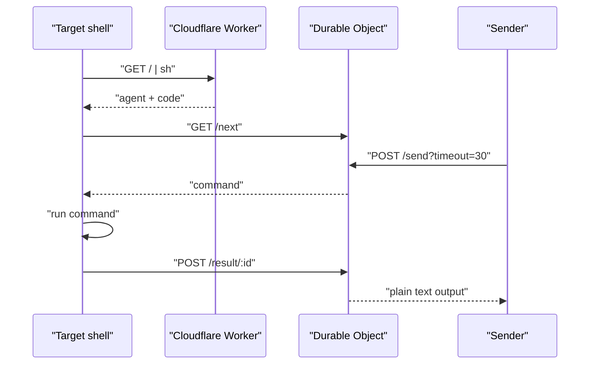

# Shell Over Edge

Reach any shell from anywhere.

[](https://github.com/Stoffberg/shell-over-edge/actions/workflows/ci.yml)
[](LICENSE)

Shell Over Edge is a tiny Cloudflare Worker relay for temporary shell access when SSH, VPN, or inbound ports are not available. Start the generated agent on the target machine, copy the 8-character code, send commands over HTTPS, and get plain text output back.

## Start

macOS/Linux:

```sh
curl -sS https://soe.stoff.dev | sh
```

Windows PowerShell:

```powershell
irm https://soe.stoff.dev/a.ps1 | iex
```

The target prints:

```text
Session: 1234abcd (copied to clipboard)
Stop anytime: Ctrl+C
```

## Commands

Raw command:

```sh
curl -sS -X POST https://soe.stoff.dev/api/sessions/1234abcd/send --data 'pwd'
```

Command with working directory and timeout:

```sh
curl -sS -X POST 'https://soe.stoff.dev/api/sessions/1234abcd/send?timeout=30' \
  --data '{"body":"pwd","cwd":"/tmp"}'
```

Close the session:

```sh
curl -sS -X POST https://soe.stoff.dev/api/sessions/1234abcd/end
```

`timeout` is URL-only. JSON command bodies support `body` and `cwd`.

## API

| Method | Path | Body | Response |
| --- | --- | --- | --- |
| `GET` | `/` | empty | POSIX agent |
| `GET` | `/a.ps1` | empty | PowerShell agent |
| `POST` | `/api/sessions/<code>/send?timeout=30` | raw text or `{"body":"pwd","cwd":"/tmp"}` | command output |
| `POST` | `/api/sessions/<code>/end` | empty | `ended` |

## Architecture



R2 stores session metadata and code lookups. A Durable Object owns each live command queue, pairs results with the right sender, and prevents parallel sends from mixing output.

## Fresh Clone

Requirements:

- Node.js 24 or newer
- pnpm 11.5.2 via Corepack
- Docker, only for `pnpm run test:containers`

Setup:

```sh
corepack enable
pnpm install --frozen-lockfile
pnpm run validate
```

`pnpm run validate` runs typecheck, test typecheck, lint, Vitest, repo audit, and a Cloudflare Worker dry-run bundle.

## Local Development

```sh
pnpm run dev
curl -sS http://127.0.0.1:8787/
```

Extra checks:

```sh
pnpm run test:load
pnpm run test:containers
pnpm run benchmark
SOE_BASE_URL=https://soe.stoff.dev pnpm run smoke:prod
```

## Tech Decisions

- Cloudflare Worker keeps the public surface to one HTTPS edge deployment.
- Durable Objects give each session one ordered queue and deterministic result pairing.
- R2 stores only session metadata and code lookup records.
- Generated POSIX and PowerShell agents avoid binary installs and release assets.
- The 8-character code is the capability; `/end` closes it explicitly.

## Limits

| Item | Limit |
| --- | --- |
| Session code | 8 characters |
| Session TTL | 2 hours |
| Command body | 64 KB |
| Result body | 1 MB |
| Command timeout | 1-50 seconds |

Automation instructions: [llms.txt](llms.txt)

Agent skill: [skills/shell-over-edge/SKILL.md](skills/shell-over-edge/SKILL.md)
